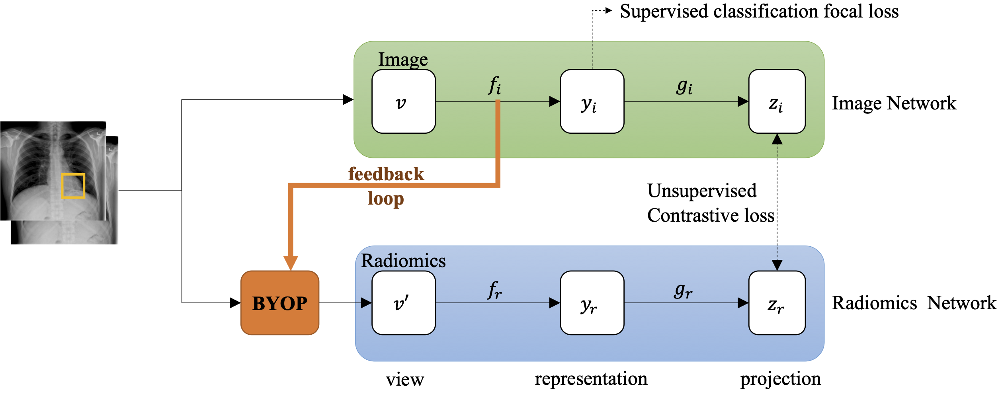
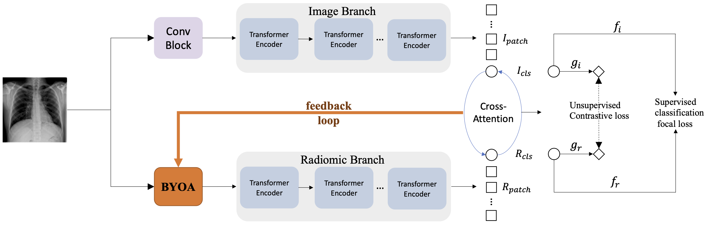

# chext

Under Development

Offical Implementation for Papers https://openaccess.thecvf.com/content/WACV2022/html/Han_Knowledge-Augmented_Contrastive_Learning_for_Abnormality_Classification_and_Localization_in_Chest_WACV_2022_paper.html and https://arxiv.org/abs/2207.04394 

# Motivation

Accurate classification and localization of abnormalities in chest X-rays play an inportant role in clinical diagnosis and treatment planning. Building a highly accurate predictive model of these tasks usually requires a large number of manually annotated labels and pixel regions (bounding boxes) of abnormalitites. However, it is expensive to acquire such annotations, especially the bounding boxes. Before the recent success of deep learning methods for automated chest X-rays analysis, practitioners used handcrafted radiomic features to quantitatively describe local patches of chest X-rays. However, extracting discriminative radiomic features also relies on accurate pathology localization. Hence we will run into an intriguing "chicken-and-egg" problem. Here, we utilize the contrastive learning in the chest X-ray domain to solve this problem, the key knob of our framework is a unique positive sampling approach tailored for the chest X-rays, by seamlessly intergrating radiomic features as a knowledge augmentation. Specifically, we first apply an image encoder (ViT or CNN-based models) to classify the chest X-rays and to generate the image features. We next leverage Grad-CAM or Self-Attention maps to highlight the crucial (abnormal) regions for chest X-rays, from which we extract radiomic features. The radiomic features are then passed through another dedicated encoder to act as the positive sample for the image features generated from the same chest X-ray. In this way, our framework constitutes a feedback loop for image and radiomic features to mutually reinforce each other.

# Framework


<p align="center">CNN-Based Framework.</p>



<p align="center">ViT-Based Framework.</p>

# Data
The NIH-CXR8 dataset can be downloaded from their offical webset: https://nihcc.app.box.com/v/ChestXray-NIHCC/folder/36938765345

# Environment

1. We recommend you to create a virtual environment.
```
conda create -n chext python=3.7
conda activate chext
```

2. Data Preprocessing
```
python3 preprocessing.py [path of images folder] [path to data_entry] [path to bbox_list_path] [path to train_txt] [path to valid_txt] [path of preprocessed output (folder)]
```


# Scripts

# Disease Classification

# Disease Localization

# Citation

```
@InProceedings{Han_2022_WACV,
    author    = {Han, Yan and Chen, Chongyan and Tewfik, Ahmed and Glicksberg, Benjamin and Ding, Ying and Peng, Yifan and Wang, Zhangyang},
    title     = {Knowledge-Augmented Contrastive Learning for Abnormality Classification and Localization in Chest X-Rays With Radiomics Using a Feedback Loop},
    booktitle = {Proceedings of the IEEE/CVF Winter Conference on Applications of Computer Vision (WACV)},
    month     = {January},
    year      = {2022},
    pages     = {2465-2474}
}

@article{han2022radiomics,
  title={Radiomics-Guided Global-Local Transformer for Weakly Supervised Pathology Localization in Chest X-Rays},
  author={Han, Yan and Holste, Gregory and Ding, Ying and Tewfik, Ahmed and Peng, Yifan and Wang, Zhangyang},
  journal={arXiv preprint arXiv:2207.04394},
  year={2022}
}
```